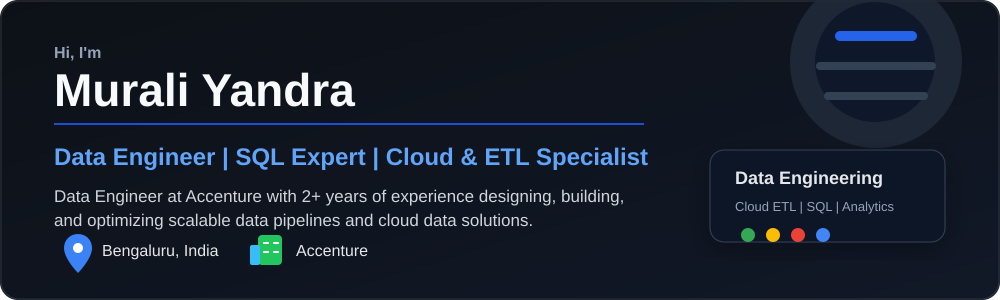
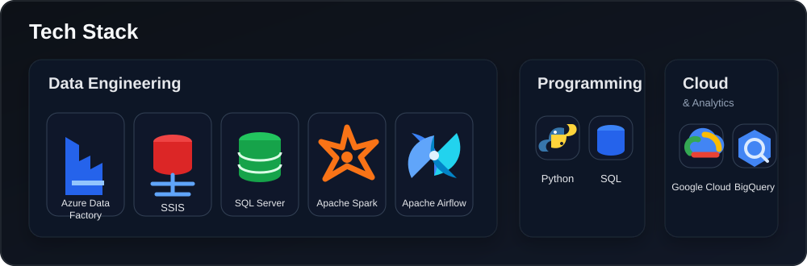
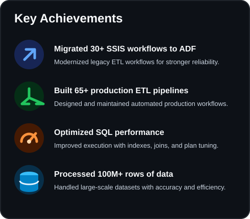
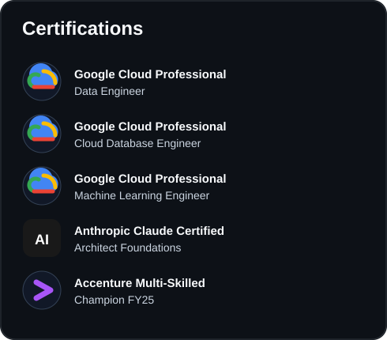
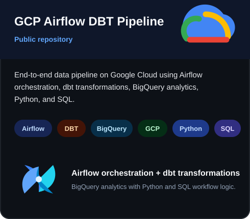
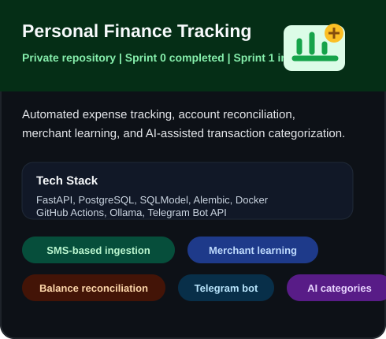

  

  

## Tech Stack

  

## Highlights

  
  

## Featured Projects

  
  

## GitHub Statistics

  
  

  

## Connect

  
  &nbsp;&nbsp;
  
  &nbsp;&nbsp;
  

  <a href="https://linkedin.com/in/murali-yandra">linkedin.com/in/murali-yandra</a>
  &nbsp;|&nbsp;
  <a href="mailto:yandramurali437@gmail.com">yandramurali437@gmail.com</a>
  &nbsp;|&nbsp;
  Bengaluru, India

