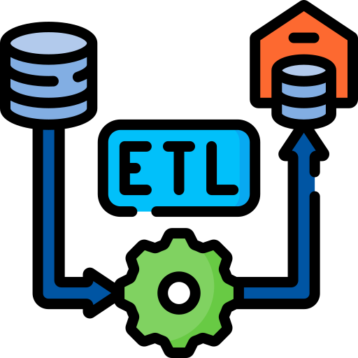
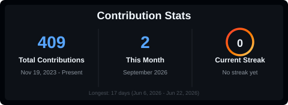
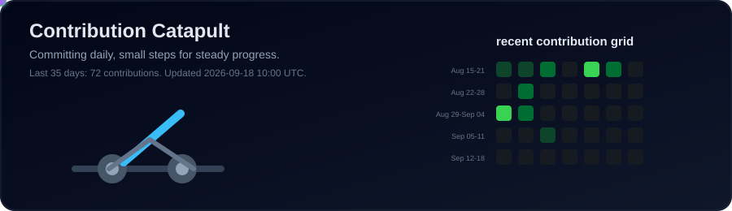

<h1 align="left">Hey Hi, I am Murali </h1>

  Thanks for visiting my profile.

  
  &nbsp;&nbsp;
  

## About Me

I am a Data Engineer at Accenture, based in Bengaluru, India. I work on data pipelines, SQL performance, cloud analytics, ETL modernization, workflow orchestration, and reliable data movement across production systems.

My focus is simple: build data platforms that are clean, automated, explainable, and useful.

## Languages and Tools

  
  &nbsp;
  
  &nbsp;
  
  &nbsp;
  
  &nbsp;
  
  &nbsp;
  
  &nbsp;
  
  &nbsp;
  
  &nbsp;
  
  &nbsp;
  
  &nbsp;
  
  &nbsp;
  
  &nbsp;
  
  &nbsp;
  

## What I Build and Work On

### Personal Finance Tracking Platform

Personal finance platform for automated expense tracking, account reconciliation, merchant learning, and AI-assisted transaction categorization.

`FastAPI` `PostgreSQL` `SQLModel` `Alembic` `Docker` `GitHub Actions` `Ollama` `Telegram Bot API`

Currently working on:

- SMS-based transaction ingestion
- Merchant learning engine
- Balance reconciliation
- Telegram bot integration
- AI-assisted categorization

Status: Sprint 0 completed, Sprint 1 in progress  
Repository: Private

### [GCP Airflow DBT Pipeline](https://github.com/murali-yandra/gcp-airflow-dbt-pipeline)

End-to-end data pipeline on Google Cloud using Airflow orchestration, dbt transformations, BigQuery analytics, Python, and SQL.

`Airflow` `dbt` `BigQuery` `GCP` `Python` `SQL`

## GitHub Stats and Streaks

  
  

## Contributions

  

