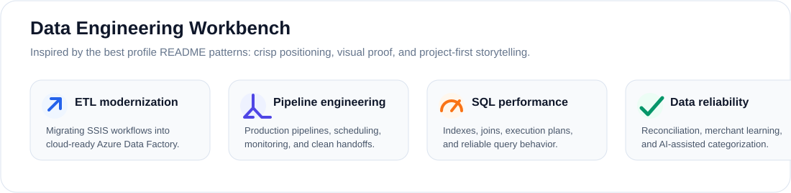
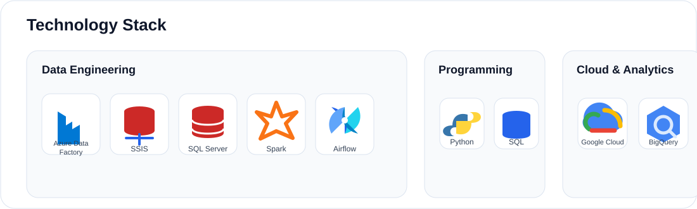
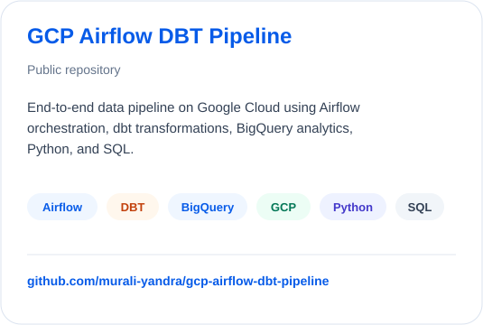
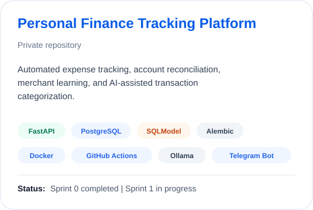
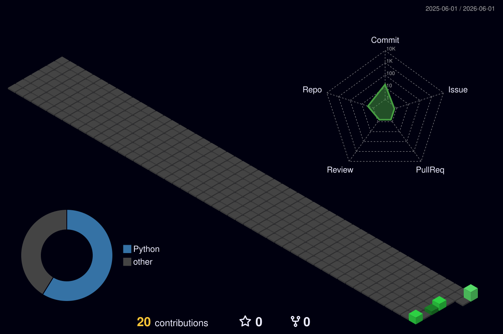

  

  
  &nbsp;
  
  &nbsp;
  

## Profile Snapshot

Data Engineer at Accenture with 2+ years of experience designing, building, and optimizing scalable data pipelines and cloud data solutions. I work across ETL modernization, SQL performance tuning, workflow orchestration, and cloud analytics systems.

  

## What I Build

  

## Tech Stack

  

## Featured Projects

  
  

## Certifications

  

## Contribution Activity

  

