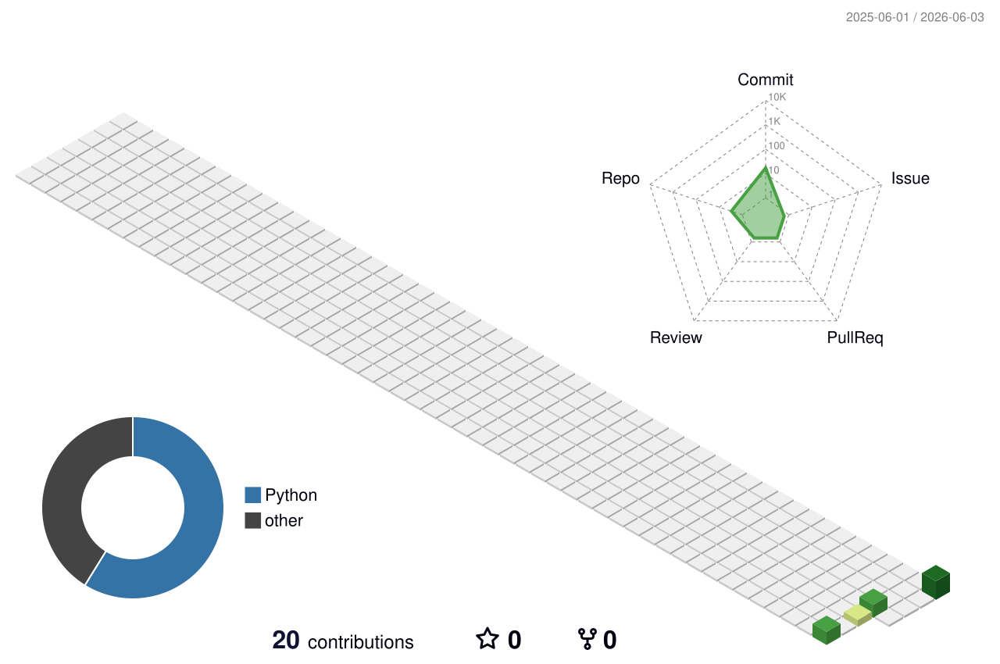

  
# 🌐 MURALI YANDRA // DATA_ENGINEER_NODE

**`[ STATUS: ONLINE ]`** | **`[ CURRENT_NODE: BENGALURU, INDIA ]`** | **`[ SYSTEMS: NOMINAL ]`**

 

Welcome to my central repository. I engineer and optimize high-throughput, enterprise-grade cloud data pipelines. Currently operating as a Data Engineer at Accenture, I specialize in migrating legacy workflows, processing massive datasets (100M+ row tables), and fine-tuning query logic down to the millisecond.

 

### 🛠️ CORE_ARCHITECTURE

  
  
  
  
  
  

### 📜 CERTIFIED_PROTOCOLS
* **Google Cloud:** Professional Data Engineer, Cloud Database Engineer, Machine Learning Engineer
* **Anthropic:** Claude Certified Architect Foundations
* **Accenture:** Multi-Skilled Champion FY25

---

 

  
### 📈 3D_COMMIT_TOPOGRAPHY
  
*Visualizing system contributions and daily commit volume.*

<!-- Switched to the Green Animate theme for a rotating, hacker-matrix vibe -->

 

---

<table align="center" width="100%">
  <tr>
    <td width="50%" align="center">
      <h3>🚀 RECENT_OPERATIONS</h3>
      <ul align="left">
        <li>Migrated ~30 SSIS workflows to Azure Data Factory (ADF).</li>
        <li>Architected 65+ ADF/SSIS pipelines for automated healthcare billing schedules.</li>
        <li>Optimized critical T-SQL stored procedures, slashing execution time from 40s to ~15s.</li>
      </ul>
    </td>
    <td width="50%" align="center">
      <!-- Highly optimized GitHub Stats Card with the Radical theme -->
      
    </td>
  </tr>
</table>

   
  

