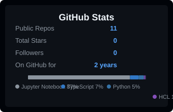

<h1 align="left">Hey, I'm Murali </h1>

  
  &nbsp;&nbsp;
  

Data Engineer at Accenture (Bengaluru) — I build pipelines that don't break at 3 AM, tune SQL until it stops crying, and convince legacy ETL systems to retire gracefully.

My focus: data pipelines, cloud analytics (GCP + Azure), workflow orchestration, and making data move without drama.

Check out my [portfolio](https://muraliyandra.framer.ai/) for the full project stories.

## Languages and Tools

  
  &nbsp;
  
  &nbsp;
  
  &nbsp;
  
  &nbsp;
  
  &nbsp;
  
  &nbsp;
  
  &nbsp;
  
  &nbsp;
  
  &nbsp;
  
  &nbsp;
  
  &nbsp;
  
  &nbsp;
  
  &nbsp;
  

## What's Keeping Me Busy

### [Finnhub Streaming Data Pipeline](https://github.com/murali-yandra/real-time-market-data-pipeline)

Real-time streaming pipeline that ingests live stock market data from Finnhub, processes it with Spark Structured Streaming, and visualizes it in Grafana. Started as a thesis project, turned into a full-stack data engineering learning experience — the classic scope creep, but the good kind.

`Apache Spark` `Kafka` `Cassandra` `Python` `Avro` `Grafana` `Docker` `Kubernetes` `Terraform`

### [GCP Data Pipeline](https://github.com/murali-yandra/gcp-airflow-dbt-pipeline)

End-to-end ELT pipeline on GCP. Data lands in Cloud Storage, gets loaded into BigQuery, and dbt transforms it into something useful — all orchestrated by Airflow. What started as "just extract some API data" turned into three full iterations. Classic.

`Airflow` `dbt` `BigQuery` `GCP` `Python` `SQL` `Docker`

### [Life Flow](https://github.com/murali-yandra/LifeFlow)

A personal habit, mood, and goal tracker I built to see how good I could make the whole thing feel to use. Tracks habits, moods, goals, and stores journal entries — because apparently I needed to engineer my way into self-reflection.

### [Iris Classifier](https://github.com/murali-yandra/Iris-flowers-Classification)

ML classifier that went from a standard notebook exercise to a full deployment pipeline. Trained three models, picked Logistic Regression, deployed it via Flask, then reimplemented the math in vanilla JavaScript so it runs entirely in the browser. No server, no excuses.

`Python` `Scikit-learn` `Flask` `Pandas` `JavaScript` `GitHub Pages`

## GitHub Stats and Streaks

  
  

## Contributions

  

---

  <i>This profile updates itself daily. Yes, I automated my own README. No, I don't have a problem.</i>

